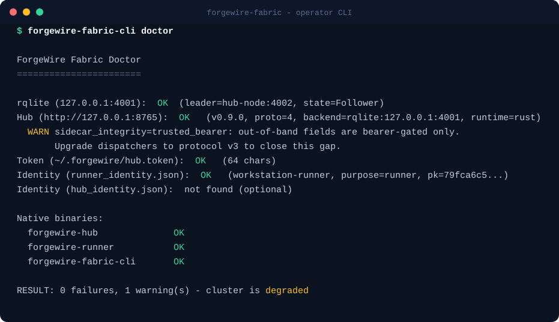

<!-- Banner. Replace assets/banner.svg with a PNG export if you prefer raster. -->


# Jeremy Shows

**Founder & Principal Engineer, ForgeWire Labs**

I build **inspectable agentic infrastructure**: repo-native work governance, secure distributed execution, human-in-the-loop communication boundaries, and practical AI software that stays useful under real-world constraints — when models are fallible, hardware is limited, infrastructure shifts, and real people depend on the result.

Former mechanic, race-car builder, fabricator, IT professional, and small-business owner, now building distributed systems and applied AI infrastructure. I see AI systems as **machinery** — assemblies of components with interfaces, tolerances, feedback paths, authority boundaries, and failure modes — and I hold them to that standard: a convincing demo is not enough; the system has to keep working when a part fails, the hardware is constrained, the requirements change, or an automated process exceeds its authority.

> **Build it. Test it under failure. Preserve the evidence. Understand its limits. Then decide whether it is useful.**

---

## What ForgeWire Labs Builds

ForgeWire Labs creates infrastructure for agentic systems that can be inspected, governed, delegated, audited, and recovered.

Most agent products ask you to trust the agent.

ForgeWire Labs is built around a different premise:

> **Inspect the work. Bound the authority. Preserve the evidence.**

The public projects are organized around the boundaries agentic systems need when they move from demos into real work:

```text
RepoPact  → inspectable work governance
Fabric    → inspectable execution governance
ForgeLink → inspectable human-agent communication governance
ForgeWire → integrated agentic environment
```

The goal is not to make a model appear autonomous. The goal is to build the surrounding infrastructure that lets models, agents, tools, humans, and machines cooperate without hiding state, authority, failure, or responsibility.

---

## Agentic Infrastructure

### 🧵 [ForgeWire Fabric](https://github.com/ForgeWireLabs/forgewire-fabric) · **Available — Alpha**

[](https://github.com/ForgeWireLabs/forgewire-fabric/releases)
[](https://github.com/ForgeWireLabs/forgewire-fabric/blob/main/LICENSE)

A self-hosted control plane for **authenticated remote task execution**.

Fabric moves work across machines while keeping authority, policy, provenance, and execution history explicit. It provides signed dispatch, scoped capability routing, policy-gated runners, structured task events, live streams, audit/replay, and a private control plane for running agentic and command work on hardware you control.

```text
authorized intent → signed dispatch → scoped runner → streamed execution → audit trail
```

Fabric is for teams and operators who want remote agents, local compute, GPU boxes, build hosts, lab machines, and private infrastructure without surrendering execution control to a hosted agent platform.

`agentic-ai` · `remote-execution` · `mcp` · `distributed-systems` · `rust`



> 📐 Architecture diagram lives in the [Fabric README](https://github.com/ForgeWireLabs/forgewire-fabric#how-it-works).
<!-- TODO: add a short terminal/demo recording (assets/fabric-demo.gif). -->

---

### 📜 [RepoPact](https://github.com/ForgeWireLabs/repopact) · **Available — Early Development**

[](https://github.com/ForgeWireLabs/repopact/blob/main/LICENSE)

A **repo-native kernel for durable work between humans and coding agents**.

RepoPact keeps authority, intent, work state, evidence, decisions, drift checks, and project history inside the repository instead of letting them vanish with each agent session. It is the harness inside the harness: Claude Code, Codex, Cursor, OpenHands, VS Code agents, or any other coding harness can enter the same governed work environment.

```text
intent → scoped authority → work item → implementation → evidence → audit → history
```

RepoPact makes short prompts possible because the repository carries the operating context. A prompt like:

```text
Proceed to the next active work item.
```

can be meaningful when the repo already defines active work, invariants, evidence gates, validation rules, completion protocol, and update expectations.

RepoPact does not replace coding agents. It gives them a durable operating environment.

`coding-agents` · `repository-governance` · `agents-md` · `developer-tools` · `ai-governance`


---

### ☎️ [ForgeLink](https://github.com/ForgeWireLabs/ForgeLink) · **Available — Early Development**

A local-first **communications and decision runtime for humans and agents**.

ForgeLink is built for both sides of the relationship: agents need a governed way to request human attention, authority, and decisions and to report outcomes; humans need a private, inspectable place to receive, review, approve, deny, defer, and replay that activity — without becoming another feed, leaking sensitive context into ordinary chat surfaces, or turning the operator into a notification target. Channels are edges; the center is governed communication state.

```text
human / agent / channel → governed communication state → decision → recorded outcome → replay
```

ForgeLink ships a provider-neutral communications runtime (Twilio and Telnyx SMS/MMS, Twilio Voice, durable call history, and a contact timeline), rich contacts with per-contact attention policy, and a working agent-human governance layer — agent identity and trust, evidence-bearing approval requests, risk tiers, signed and replayable decision records, and a tamper-evident audit chain — on an Electron/TypeScript app with local SQLite, an MCP human bridge, per-channel credentials, and backup/export tooling. In progress: an operator cockpit (Decisions · People · Agents · Channels) and a mobile decision companion.

It is not a phone clone, social feed, public messaging platform, work runner, or hosted notification relay. It is a private operator boundary for human-agent communication.

`human-in-the-loop` · `operator-cockpit` · `communications-runtime` · `mcp` · `electron` · `agentic-ai`

---

## Product Work

### 🎓 [SkillForge Academy](https://github.com/ForgeWireLabs/skillforge-academy) · **Downloadable Product**

[](https://github.com/ForgeWireLabs/skillforge-academy/releases)

An **offline-first certification learning and exam-prep desktop app**, starting with CompTIA A+.

SkillForge Academy includes original practice questions, performance-based questions, mock exams, spaced-repetition flashcards, readiness analytics, and local progress storage. It is built with Tauri, Rust, and React.

SkillForge is not part of the agentic infrastructure stack, but it reflects the same engineering priorities: local-first operation, practical usefulness, visible progress, durable state, and software that remains useful without a cloud dependency.

`comptia` · `exam-prep` · `tauri` · `rust` · `react` · `offline-first`


---

## The Larger System: [ForgeWire](https://github.com/ForgeWireLabs/ForgeWire-Overview)

The public projects above are extracted from, adjacent to, or designed for a larger **privately developed** system.

ForgeWire is a modular architecture for coordinating models, agents, tools, skills, personas, memory, knowledge, task execution, automation, policy, human interaction, and distributed compute.

Its engineering thesis:

> **Agentic systems are systems first and models second.**

A capable model can still be part of an unreliable system.

Models can be wrong, slow, expensive, unavailable, deprecated, or replaced. Providers change. Dependencies fail. Hardware becomes constrained. Requirements evolve. People still need the system to preserve context, expose what happened, recover when possible, and respect authority boundaries.

ForgeWire focuses on the infrastructure around models:

- graceful degradation
- explicit ownership boundaries
- provider freedom
- behavioral parity
- durable audit trails
- recoverable execution
- bounded agent authority
- replaceable components
- inspectable failure states
- human approval paths
- repo-native memory and governance

The [public overview](https://github.com/ForgeWireLabs/ForgeWire-Overview) documents the direction and release status without presenting unfinished private work as a product.

---

## How the Pieces Fit

```text
Outer harness
Claude Code / Codex / Cursor / OpenHands / VS Code agents / local agents
        |
        v
RepoPact
repo-native work governance:
invariants, active work, evidence, drift, decisions, history
        |
        v
ForgeWire
provider network, personas, skills, memory, knowledge, orchestration
        |
        +----------------------+
        |                      |
        v                      v
Fabric                 ForgeLink
secure execution       human-agent communication
dispatch, policy,      ask, decide, record,
streams, audit         replay outcome
        |
        v
Runner / model
minimal safe projection needed to act
```

The model should not be the security boundary.

The prompt should not be the only memory.

The chat window should not be the audit log.

The human should not become a notification endpoint.

ForgeWire Labs projects are built to move those responsibilities into inspectable infrastructure.

---

## How I Build

- **Systems before components.** A working part is not a working system. I design for seams, failure modes, authority boundaries, recovery paths, and operational evidence first.
- **Evidence over demos.** Releases should include documentation, tests, security context, known limitations, architecture, and validation paths so they can be evaluated seriously.
- **Prompt text is not a security boundary.** Agents receive projected authority; tools, policy, scope, and execution layers enforce what is actually allowed.
- **Parity and portability.** Acceleration paths get portable reference implementations. The system should not be pinned to one language, model provider, database, harness, cloud, or machine.
- **Local-first where it matters.** Human communication, credentials, private state, and operator decisions should remain close to the person unless a stronger boundary is deliberately designed.
- **Research is gated.** Speculative ideas move through isolated implementation, baseline comparison, controlled evaluation, failure analysis, observe-only integration, and limited canary testing before production adoption.
- **Failure should become state.** A failed provider, denied approval, broken dependency, missing capability, or exceeded authority should be visible, recoverable system state — not confident language hiding uncertainty.

**Stack:** Rust · Python · TypeScript · React · Tauri · Electron · GTK · SQLite · rqlite · PostgreSQL · PowerShell · GitHub Actions

---

## Lineage & Archive

The current work descends from years of building, failure, and reconstruction:

```text
SCOUT → SCOUT-2 → ATLAS → PhrenForge → ForgeWire
```

Across those generations:

- a chatbot became a multi-persona assistant
- prompts became tools, skills, permissions, and services
- direct execution gained policy and capability boundaries
- scattered context became repo-native memory and governance
- local workflows expanded into authenticated distributed execution
- human communication became a private attention and approval boundary
- model-centered development became systems-first engineering

Historical projects:

- [SCOUT-2](https://github.com/ForgeWireLabs/SCOUT-2) — *Historical.* Multi-agent assistant platform; a record of experiments, communication tools, agent patterns, and architectural limits that led to ForgeWire, ForgeLink, and later infrastructure.
- Earlier public projects (**SCOUT**, **Feed-Portal**, **MED.I.C.**) are *archived* and kept for history — not current work.

---

<!-- TODO (headshot — on you): once you add assets/headshot.jpg, uncomment the block below.

-->

<!-- TODO (writing): drafts live in writing/. Once finalized, uncomment to surface them.
## Writing

- **Agentic systems are systems first and models second** — reliability lives in the assembly, not the component.
- **Why coding agents need repository-native governance** — binding invariants and durable state in the repo.
- **Remote agents without surrendering execution control** — signed dispatch, scope-bound tokens, audited runs.
- **Human attention is infrastructure** — why agent systems need private communication boundaries.
- **Building serious AI infrastructure on constrained hardware** — constraints as a design input.
- **What failed between SCOUT and ForgeWire** — the lineage read as corrected structural failures.

---
-->

**Independent · founder-led · evidence-driven.** Reach me through the repositories above, or open an issue/security advisory on the relevant project.
