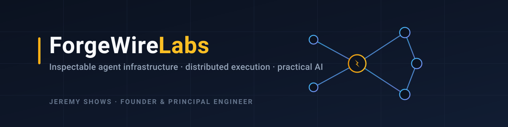
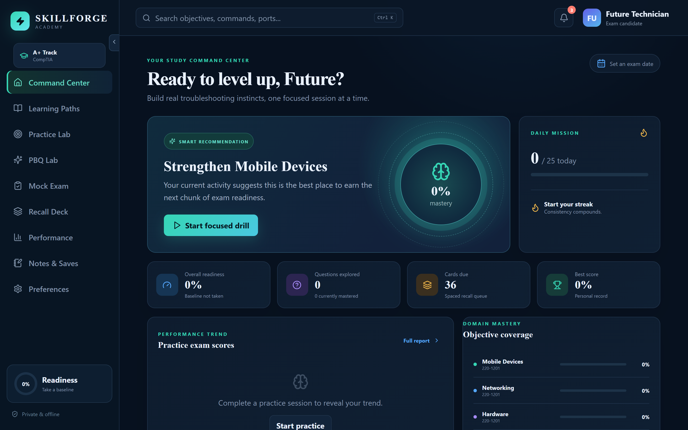

<!-- Banner. Replace assets/banner.svg with a PNG export if you prefer raster. -->


# Jeremy Shows

**Founder &amp; Principal Engineer, ForgeWire Labs**

I build **inspectable agent infrastructure, distributed execution systems, and practical AI software that stays useful under real-world constraints** — when models are fallible, hardware is limited, infrastructure shifts, and real people depend on the result.

Former mechanic, race-car builder, fabricator, IT professional, and small-business owner, now building distributed systems and applied AI infrastructure. I see AI systems as **machinery** — assemblies of components with interfaces, tolerances, feedback paths, and failure modes — and I hold them to that standard: a convincing demo isn't enough; the system has to keep working when a part fails, the hardware is constrained, the requirements change, or an automated process exceeds its authority.

> **Build it. Test it under failure. Preserve the evidence. Understand its limits. Then decide whether it's useful.**

---

## Flagship Work

### 🧵 [ForgeWire Fabric](https://github.com/ForgeWireLabs/forgewire-fabric) · **Available — Alpha**

[](https://github.com/ForgeWireLabs/forgewire-fabric/releases)
[](https://github.com/ForgeWireLabs/forgewire-fabric/blob/main/LICENSE)

A self-hosted control plane for **authenticated remote task execution** — move work across machines while keeping authority, policy, provenance, and execution history explicit. Signed dispatch, scope-bound capability tokens, policy-gated runners, structured task events, and a federated overlay, with behavioral parity between Python and Rust.

`agentic-ai` · `remote-execution` · `mcp` · `distributed-systems` · `rust`

> 📐 Architecture diagram lives in the [Fabric README](https://github.com/ForgeWireLabs/forgewire-fabric#how-it-works). <!-- TODO: add a short terminal/demo recording (assets/fabric-demo.gif). -->

### 📜 [RepoPact](https://github.com/ForgeWireLabs/repopact) · **Available — Early Development**

[](https://github.com/ForgeWireLabs/repopact/blob/main/LICENSE)

A **repository-native operating system for durable work between humans and coding agents**. It keeps authority, intent, work state, evidence, decisions, and project history *inside the repository* instead of letting them vanish with each agent session.

```text
intent → scoped authority → work item → implementation → evidence → audit → history
```

`coding-agents` · `repository-governance` · `agents-md` · `developer-tools` · `ai-governance`


### 🎓 [SkillForge Academy](https://github.com/ForgeWireLabs/skillforge-academy) · **Downloadable Product**

[](https://github.com/ForgeWireLabs/skillforge-academy/releases)

An **offline-first certification learning and exam-prep desktop app**, starting with CompTIA A+. Original practice questions, performance-based questions, mock exams, spaced-repetition flashcards, readiness analytics, and local progress storage. Built with Tauri + Rust + React.

`comptia` · `exam-prep` · `tauri` · `rust` · `react` · `offline-first`



---

## The Larger System: [ForgeWire](https://github.com/ForgeWireLabs/ForgeWire-Overview)

The flagships above are public pieces of a larger, **privately developed** system. ForgeWire is a modular architecture for coordinating models, agents, tools, memory, knowledge, compute, and distributed execution. Its engineering thesis:

> **Agentic systems are systems first and models second.**

A capable model can still be part of an unreliable system. ForgeWire focuses on the infrastructure *around* models: graceful degradation, explicit ownership, behavioral parity, audit trails, recoverable execution, bounded authority, and replaceable components. The [public overview](https://github.com/ForgeWireLabs/ForgeWire-Overview) documents its direction and release status without presenting unfinished work as a product.

---

## How I Build

- **Systems before components.** A working part is not a working system. I design for the seams — failure modes, authority boundaries, and recovery — first.
- **Evidence over demos.** Releases ship with documentation, tests, security context, known limitations, and architecture so they can be evaluated seriously.
- **Parity and portability.** Acceleration paths get portable reference implementations; the system isn't pinned to one language, model provider, database, or cloud.
- **Research is gated.** Speculative ideas move through baseline comparison, controlled evaluation, and failure analysis before they touch production — and a better question is a valid result.

**Stack:** Rust · Python · TypeScript · React · Tauri · GTK · SQLite · rqlite · PostgreSQL · PowerShell · GitHub Actions

---

## Lineage &amp; Archive

The current work descends from years of building, failure, and reconstruction:

**SCOUT → SCOUT-2 → SCOUT-3 → ATLAS → PhrenForge → ForgeWire**

- [SCOUT-2](https://github.com/ForgeWireLabs/SCOUT-2) — *Historical.* Multi-agent assistant platform; a record of the experiments and architectural limits that led to ForgeWire.
- Earlier public projects (**SCOUT**, **Feed-Portal**, **MED.I.C.**) are *archived* and kept for history — not current work.

---

<!-- TODO (headshot — on you): once you add assets/headshot.jpg, uncomment the block below.

-->

<!-- TODO (writing): drafts live in writing/. Once finalized, uncomment to surface them.
## Writing

- **Agentic systems are systems first and models second** — reliability lives in the assembly, not the component.
- **Why coding agents need repository-native governance** — binding invariants and durable state in the repo.
- **Remote agents without surrendering execution control** — signed dispatch, scope-bound tokens, audited runs.
- **Building serious AI infrastructure on constrained hardware** — constraints as a design input.
- **What failed between SCOUT and ForgeWire** — the lineage read as corrected structural failures.

---
-->

**Independent · founder-led · evidence-driven.** Reach me through the repositories above, or open an issue/security advisory on the relevant project.
